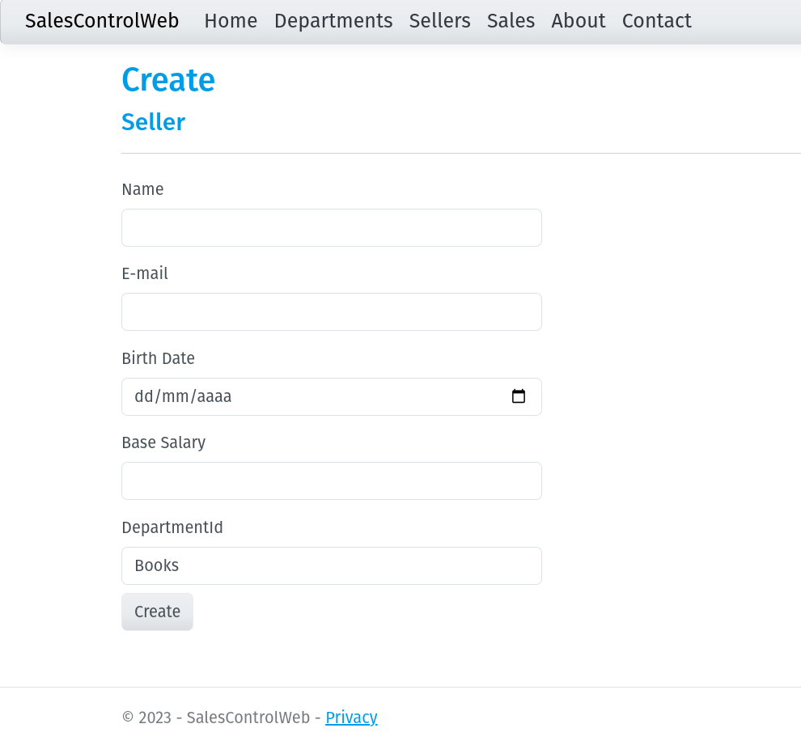

# sales-control

Application using MVC, sales control, salesperson registration and sales visualization, using MySQL database

## 🚀 Getting Started

### 📋 Prerequisites

Make sure you have the following installed on your machine:

- [.NET SDK](https://dotnet.microsoft.com/download)

## Features

* Registration and management of customers.
* Registration and management of products.
* Recording and control of sales.

## Screenshots

### Departments and create

### Seller table

### Create new seller

### Simple search and Grouping search

### Search result Grouping search

---
